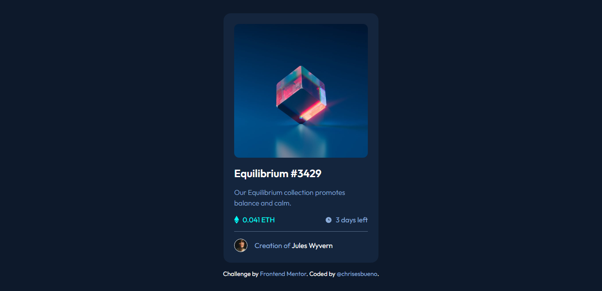

# Frontend Mentor - NFT preview card component solution

This is a solution to the [NFT preview card component challenge on Frontend Mentor](https://www.frontendmentor.io/challenges/nft-preview-card-component-SbdUL_w0U). Frontend Mentor challenges help you improve your coding skills by building realistic projects. 

## Table of contents

- [Overview](#overview)
  - [The challenge](#the-challenge)
  - [Screenshot](#screenshot)
  - [Links](#links)
- [My process](#my-process)
  - [Built with](#built-with)
  - [What I learned](#what-i-learned)
- [Author](#author)

## Overview

### The challenge

Users should be able to:

- View the optimal layout depending on their device's screen size
- See hover states for interactive elements

### Screenshot



### Links

- Solution URL: [Add solution URL here](https://www.frontendmentor.io/solutions/nft-preview-card-khEUYuUsQL)
- Live Site URL: [Add live site URL here](https://chrisesbueno.github.io/nft-preview-card/)

## My process

### Built with

- Semantic HTML5 markup
- CSS custom properties
- Flexbox
- CSS Grid
- Mobile-first workflow

### What I learned

```css
.image__container {
    position: relative;
}
.nft {
    width: 100%;
    height: 100%;
    border-radius: 0.7rem;
    cursor: pointer;
}
.background {
    display: none;
}
.nft:hover + .background {
    display: flex;
    justify-content: center;
    align-items: center;
    position: absolute;
    top: 0%;
    background-color: hsla(178, 100%, 50%, 0.5);
    width: 100%;
    height: 99%;
    border-radius: 1rem;
}
.background img {
    width: 50px;
    height: 50px;
}
```

## Author

- Frontend Mentor - [@chrisesbueno](https://www.frontendmentor.io/profile/chrisesbueno)
- Twitter - [@chrisesbueno](https://www.twitter.com/chrisesbueno)
